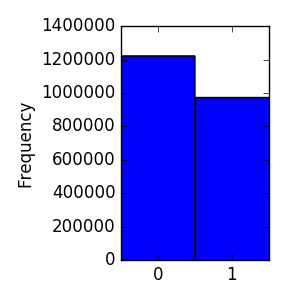
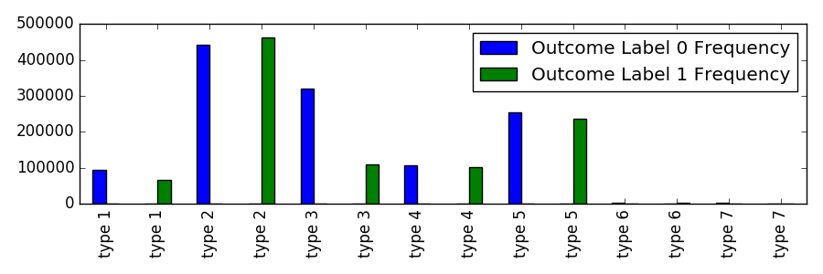
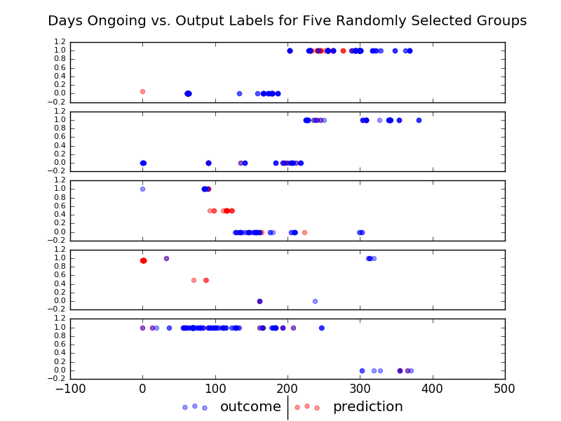

# Capstone Project
## Machine Learning Engineer Nanodegree
Kevin Palm  
August, 2016

## I. Definition

### Project Overview
The official project overview can be found on the
[competition description page](https://www.kaggle.com/c/predicting-red-hat-business-value).
The following overview is just my own paraphrasing and
interpretation of the competition goals/context.

Red Hat is a software company which specializes in open-source,
linux-based enterprise solutions. They're interested in
improving their models which classify potential clients as future
clients, which is understandable because once that a company knows who
their serious prospects are they can devote extra resources to winning
them over.

They've just released three anonymized data sets for Kagglers to
use as they compete on creating that improved model.

The first data set is a one pertaining to the people in the data set -
potential and past clients - and what kind of characteristics those
people have. All of the characteristics are anonymized, in the sense
that the column headers are named things like "char_1" and "char_2",
rather than "Gender" or "Location". Most of the characteristics are
booleans. There is also an unlabeled date column and a feature called
"group_1". The people data set can be joined to the other two files
using a unique identifier field they provide.

The second data set is the competition training data, which similarly
contains a date column, a feature called "activity category", and 10
anonymized characteristic columns - this time presumably pertaining to
the characteristics of each activity. In addition, there is a final
column called "outcome", which has two potential values of 0 or 1, and
which is the feature which the competition has us attempting to predict.

The third data set is the testing data, which is exactly the same format
as the training data except that it lacks the "outcome" column.

The problem domain of this challenge definitely includes supervised
machine learning.
Also, I think this competition will be hugely a problem of exploratory
data analysis and observation. The anonymized features introduce a lot
of challenge in the sense that they remove most elements of business
intuition and make the contestants almost totally relent on raw data
analysis. But at the same time, that reliance on data analysis can
provide the benefit or eliminating researcher bias, in the sense that I
might give each feature a more thorough look into its applications than
if I were to come in with preconceptions about each feature's
usefulness.

I think this project has special application to business development and
marketing departments for companies which tailor to enterprises. The
framing of the challenge matches the overall theme of how many
businesses are attempting to automate and make data driven processes for
"qualifying" their marketing and sales leads.

### Problem Statement
Ultimately, the goal of this project is to create a list of true/false
predictions which append to the testing data set. The competition
guidelines don't specifically explain what it is that competitors are
predicting, but I would guess the general gist of it is something like
"Will this prospect become a client in the next thirty days?" So, given
that the training/testing data actually represents activities, I think a
good problem statement for this project would be this:

**As potential customers interact with Red Hat in the future, some of
their activities will be of interest and some will not, and we want
to know which so Red Hat can better use their selling resources.**

My expected tasks towards a solution to this problem statement are:

1. **Exploratory data analysis and data joining** - there's going to be
a lot of EDA required for this project. Understanding how that these
data sets were created, split up, and set up will be critical to
creating the right model in the end. I don't have the history or any
inside knowledge about the quirks of the data, and I'll need to know as
much as I can to create the right model. It will be an investigation.
During this phase, I'll need to join the people data set to the other
data sets.
2. **Feature preparation** - I'll format the data in an appropriate
manner for my final model. Exactly how I go about this will be hugely
reliant on the EDA step, as how I condition features and which algorithm
I intend to use will be dependant on what I've learned so far.
3. **Early Modelling** - I'll create a model that outputs predictions,
using a subset of the training set so that I can use classification
metrics on the leftover training data. I'll use the metric scores to
tune my model.
4. **Model** - I'll apply my model testing data which outputs a
predictions file in the correct format for submission to kaggle.com,
and submit the entry.
5. **Repeat** - I'll go back, learn more, and improve.

### Metrics
This Kaggle competition is scored on area under receiver operating
characteristic curve (AUC). AUC is a bit less intuitive of a
classification metric, but in the words of the top reply to
[this excellent blog post on the subject](http://fastml.com/what-you-wanted-to-know-about-auc/):

> Pick a random negative and a random positive example; The AUC gives
> you the probability that your classifier assigns a higher score to the
> positive example (ie, ranks the positive higher than the negative).

-- <cite>*Directly copied from Peter Prettenhofer, but also the same
explanation is cited on Wikipedia from "Fawcett, Tom (2006); An
introduction to ROC analysis, Pattern Recognition Letters, 27,
861–874"*</cite>

I think probably the reason this metric was chosen over accuracy is that
the ratio of each output label is not equal, and one of the benefits of
AUC is that it isn't negatively affected by imbalances in the frequency
of labels.

Understanding why that this competition is scored on AUC over, say, F1
score (which is also able to deal with imbalanced label frequencies) is
less clear. The best discussion I've found comparing F1 and AUC to each
other is from
[this stackoverflow thread](http://stackoverflow.com/questions/34698161/how-to-interpret-almost-perfect-accuracy-and-auc-roc-but-zero-f1-score-precisio).
My best guess right now is that Red Hat must be interested in a model
that will perform well as conditions and label frequencies experience
structural change over time, and that the changing thresholds comprising
AUC could simulate that change. Perhaps we're making a model to last
through the good times and the bad, the times of plenty and the days of
tough sells.

Anyways, that's my best guess. I think left to my own devices I would
prefer to use F1 as a metric for this project, but in the spirit of
competition I'll be optimizing for AUC.

## II. Analysis

### Data Exploration
There are 55 total columns after merging the people data to the training
data. One of which is the output label feature to predict. Two are id
columns, two are date columns, and two are group/type columns (one of
each for people and one of each for activities). The the rest are
characteristics, 10 of which pertain to activity characteristics and 38
of which pertain to person characteristics.

#### Output Labels
There are 975,497 rows of data with labels of 1, and 1,221,794 rows with
labels of 0 (a grand total of 2,197,291 rows of training data).

So the output labels are binary and somewhat close to equally
distributed. Exploring these labels' relationships with the other
features is the whole point of this project, but as a first step it's
nice to know that there's a somewhat balanced amount of examples for
each label in our training data.

#### Date Columns
The date field for the activities ranges from 2022-07-17 through
2023-08-31, so we have about one year of anonymized activities data. The
date field for people ranges from 2020-05-18 through 2023-08-31, so
whatever people date represents we have about 3 years worth of it.

A
[really fantastic exploration of the relationship between the frequency of these dates and the output labels that I really can't outdo](https://www.kaggle.com/anokas/predicting-red-hat-business-value/time-travel-eda)
was created by Kaggle user anokas. The big take home observations of the
analysis where:

* There's a strong weekend/weekday trend to the activities date, in
which more activates occur during weekdays and the likelihood of
positive labels on weekends drops.
* There's also a weekend/weekday trend to the people date frequencies,
but on a considerably lesser scale. Any trends between the likelihood of
a given label based on people date is less apparent.
* The training and the testing sets have similar frequency
distributions for activity date, suggesting that the train test split
was not based on time.
* The training and testing sets have a lesser similarity between people
date, but which grows more similar each progressive year.

I think a reasonable hypothesis concerning the dates is that the
activity date pertains to the date of the actual activity, and the
people date pertains to some significant event that every person has.
An example of what the people date might be could be the date that they
signed up for an account on the website, or the date that they first
contacted Red Hat.

#### Group/type Columns
There are only seven activity types, and most of them don't look to be
that great of indicators for the output labels on their own.

Of all the activity types, type 3 looks like it has the most information
pertaining to the labels on its own. However, recall that the
overall training set has more 0 labels than 1s, so some of the increased
likelihood for label 0 is exaggerated. It's certainly still possible
that this feature will be more useful to us in conjunction with other
features.

For the people group columns, there are 29,899 unique groups in the
training data and 11,640 unique groups in the testing data. There's a
huge focus on this feature right now on the Kaggle competition page,
because the feature in conjunction with the action date
[was recently demonstrated by Kagglers loiso and team as able to be used to achieve ~0.987 AUC with just some logic and simple statistics](https://www.kaggle.com/loisso/predicting-red-hat-business-value/lb-0-987-group-1-and-date-trick/output).
A really great
[explanation of the technique was written by dmi3kno](https://www.kaggle.com/dmi3kno/predicting-red-hat-business-value/redhat-hack-in-plain-english-eda).
The whole thing is getting called a hack or a leak, but the
overall consensus is that the discovery doesn't necessarily break the
competition. It just makes the competition a small numbers game about
perfecting predictions for the relatively few rows of data in which
their label cannot be directly inferred from the original features.

So what is group_1? It appears to be clusters of people who all had the
same dates for when their activities switched labels. So for instance,
for a given cluster, we might be able to infer that anything before
January 3rd was labeled 0 and anything after is labeled 1. Very powerful
stuff considering that those labels are the whole point of the
competition, and a good example of how powerful EDA can be.

#### Characteristics Columns

There are 10 characteristic columns pertaining to activities, and 38
pertaining to people.

All of the activities characteristics are groupings, with values such as
"type 1" and "type 2". Most of those columns appear to have less than 50
possible values, but one does include more than 7,000 types.

Nine of the people characteristics are also groupings, and they're all
less than 50 types. Twenty-eight are booleans. And one is an integer
class, with values from 0 to 100.

I published
[my own kernel exploring the people characteristics exclusively, and whether or not it makes sense to use decomposition techniques on them prior to joining them into the data set](https://www.kaggle.com/kevinpalm/predicting-red-hat-business-value/people-eda-and-decomposition).
I found that all of the characteristics in the people data set were
interrelated. After expanding all the features out to be one-hot encoded
(and for the case of the integer column, min-max scaled) there were 160
resulting columns. PCA worked pretty well, with 28 components
explaining 80% of the variance in the data, and 50 components explaining
90% of the variance in the data. So I think using activities
characteristics while keeping my dimensions under control will work out.

### Exploratory Visualization
Because the data leak is going to be an important part of this
competition, and because it's a little tricky to understand exactly how
the leak happened, I'm devoting this section to my benchmark model
[which is inspired by and very similar to the loisso team's leak model](https://www.kaggle.com/loisso/predicting-red-hat-business-value/lb-0-987-group-1-and-date-trick/output).

The following graphic is five separate scatter plots, each of a randomly
selected people group from the "group_1" feature, with predictions from
my benchmark model. The graph was definitely inspired by one that
[dmi3kno created originally](https://www.kaggle.com/dmi3kno/predicting-red-hat-business-value/redhat-hack-in-plain-english-eda),
but this one pertains specifically to 
[my implementation of the leak/exploit model](https://www.kaggle.com/kevinpalm/predicting-red-hat-business-value/simplified-leak-starter-template/output).

On the x axis we have the days ongoing since the group first appeared,
and on the y axis is the output label. Hopefully looking at this graph,
how that the benchmark model inferred the labels that it is a little
more intuitive.

To walk through the logic, though, the model basically looks at each
point that it needs to estimate. It looks at the nearest output from the
training set on the right, and it looks at the nearest output on the
left. If they both agree, it assigns the same label to the point it is
currently estimating. If they disagree, it assigns a label of 0.5. If
the point happens to be on the rightmost or leftmost extreme, it assumes
the closest output label is correct. Finally, it adds a little
cushioning to any of the less certain values, such as the values on the
rightmost and leftmost extremes.

No doubt a lot of kagglers are going to use an inferential leak
model as their first pass, and then estimate the remaining data points
with a more sophisticated model. I think that's a very valid approach,
as there are still 70,000 remaining points that have disagreeing labels
to each side of them. I think the other dominant approach will be to
create a model that accounts for the leak by "translating" it into the
input features. Whichever way the problem is approached, the
relationship between activity dates and people groups is very important!

### Algorithms and Techniques
Given that this project is for a machine learning nanodegree, I'm going
to use the approach of translating the leak (and other relevant
features) into a machine learning model!

So what will my final regressor be? I think this is a classically good
use case for gradient boosting. I think it'll be very doable to set up
a bunch of decent predictor features like normal, but also include a
feature suggesting which label the leak would classify and some
measure(s) of that label's dependability. Say that I created a feature
that was a scale of 1-100 for how dependable the leak approach was for
each point - a gradient boosting regressor would train individual
decision trees for each step along that scale of 1-100. Hopefully the
end effect would be that the leak approach trumps all else for some of
the higher measures of dependability, and the data points that are more
uncertain from the leak perspective can be taken in context of the other
features. At least that would be a simplified way of approaching it.

Some specific examples of what could constitute those measures of the
leak feature's dependability might be:

* How many units away the right and left nearest neighboring labels are
* The density of the neighbors within some range, and their label
uniformity
* If the right and left nearest neighbors even have the same label

In addition to the features that translate the data leak to my final
estimator, I want to include information pertaining to:

* Date seasonality - like what day of the week, or which month. I'll try
creating these kinds of features for both the activity date and the
people date, then they'll need to be one hot encoded.
* Boolean characteristics - the characteristics that are true/false will
be easiest to include in the model, they just need to be converted to 0s
and 1s.
* Categorical characteristics and activity type - I want to include
information from the characteristics and activity type features, but how
that I can do that depends on how many categories are in each feature. I
definitely can't just one-hot encode the features that have 1,000+
categories, that will be way too many dimensions. So it'll be a
combination of one hot encoding, and for the big ones I'll be using
feature hashing or
[leave one out encoding](https://www.kaggle.com/c/caterpillar-tube-pricing/forums/t/15748/strategies-to-encode-categorical-variables-with-many-categories).
* Integer characteristics - there's only one of these. I expect to just
end up scaling this feature, but I may experiment with one-hot encoding
if I end up deviating from the gradient boosting regressor.

Then finally, on top of all this, I'm expecting to have some PCA or RCA
in the mix just to try and keep my dimensions under control. Gradient
boosting is a computationally expensive algorithm and this is a big
data set, so keeping my running time and memory requirements reasonable
is going to be a major concern.

### Benchmark
For this project, my benchmark is going to be my exploit/leak inference
model that's sort of a simplified version of lasio and team's. The
exploit model is mostly about filling NaNs in a tricky way, so I figure
that my final model should be able to beat that with the right feature
engineering, as the target information is pretty plainly contained in
the data.

It may turn out to be a challenging benchmark. For context, the exploit
model scores 0.987028 AUC (1.0 is the maximum possible) and at the time
of writing this scoring anything above that puts you in the top 15% of
the leaderboard.

Not to say that this project will be evaluated entirely off the Kaggle
leaderboard, though. When cross validating locally using a split of the
training data file, I'll be evaluating both my final model
and the leak model. I hope to have a final model that beats the leak
model for every random split of the data.

## III. Methodology

### Data Preprocessing
To start off my data preprocessing, I needed to translate the data leak
into my estimator. I also needed to resplit my training and testing data
so that the leaked rows from the testing data were instead included in
the training data.

Ultimately, I created four features to translate the leak. One is a
boolean denoting the closest known label from the same group looking
backwards in time, and one is the same looking forward. Then I created
a feature which is equal to the distance to that backward point as a
proportion of the overall group density (number of known labels from the
group divided by the date range for the group). And again, a similar
feature for looking forward. The units on those latter two features are
a bit strange - technically it's days squared over activities - but it
seems to work out for the model. Finally, for all the missing values I
filled with -1, because those four features are otherwise always
positive and gradient boosting should be fine to handle the -1s as their
own case. The code for this stage of the preprocessing is located in
utilities.py under extract_leak_features().

Next, I tried to create some real features. For activity date I created
one-hots for the day, weekday, and month. For people date I created
one-hots for the month and the year. I got to copy over all the features
that were already booleans, I scaled the one ordinal feature to be
between 0 and 1 as well, and then I one-hot encoded the remaining
categorical features that didn't contain more than 100 unique possible
values. At this point, I'm dropping all the columns that contain NAs and
too many categories to one-hot encode - I may revisit the issue later to
see if I want to salvage anything. Finally, on this big giant data set,
I run a PCA and only keep the 20 components of greatest variance. The
code for this stage of the preprocessing is located under utilities.py
under prep_features().

So I end up with a total of 24 features in my final model.

### Implementation
I used the scikit-learn gradient boosting regressor implementation for
my final model. Because sklearn handles all the heavy lifting, all my
implementation required was:

1. I extracted the leak features and resplit the data based on the leaks
2. I extracted the principle components and joined them with the leak
features
3. I trained the gradient boost regressor on the outcomes and features,
and appended the predictions to the test data frame
4. I returned predictions and the leaked labels to the original testing
index.

### Refinement
The out of the box gradient boosting regressor did beat the benchmark
score when submitted to Kaggle at this point. It scored 0.987882 AUC,
which is 0.000854 AUC higher than the benchmark. At the time of writing,
that translates to 0.004842 AUC under the leading model, and in the top
20% of the leaderboard.

So next I started local testing with different parameter tunings. I set
up my local test to split by people ID, with 2,000 people IDs and their
corresponding activities going to each the training and the testing
sets. For each parameter tuning, I took the average of three runs. The
results of those tests are in the table below.

| Learning Rate | N Estimators | Max Depth | Local Score (Delta Benchmark) | Kaggle Score (AUC) |
|---------------|--------------|-----------|-------------------------------|--------------------|
| 0.3           | 50           | 2         | 0.040443315                   | 0.987842           |
| 0.3           | 100          | 2         | 0.008453154                   | 0.987832           |
| 0.3           | 100          | 3         | 0.008119399                   | 0.987881           |
| 0.3           | 150          | 4         | 0.00497335                    | 0.987732           |
| 0.1           | 100          | 4         | 0.004393546                   | 0.987882           |
| 0.2           | 150          | 3         | 0.003847023                   |                    |
| 0.5           | 150          | 3         | 0.003387742                   |                    |
| 0.4           | 50           | 3         | 0.00311012                    |                    |
| 0.2           | 100          | 4         | 0.002753689                   |                    |
| 0.5           | 100          | 2         | 0.002540337                   |                    |
| 0.4           | 100          | 2         | 0.00240208                    |                    |
| 0.2           | 50           | 3         | 0.002017758                   |                    |
| 0.4           | 50           | 2         | 0.001837789                   |                    |
| 0.3           | 150          | 2         | 0.001612978                   |                    |
| 0.3           | 50           | 4         | 0.001266027                   |                    |
| 0.5           | 100          | 3         | 0.00101742                    |                    |
| 0.4           | 50           | 4         | 0.000894402                   |                    |
| 0.5           | 100          | 4         | 0.000522531                   |                    |
| 0.1           | 50           | 2         | 0.00012683                    |                    |
| 0.1           | 100          | 2         | 0.000115795                   |                    |
| 0.1           | 50           | 3         | 2.90E-05                      |                    |
| 0.2           | 150          | 4         | -0.000111787                  |                    |
| 0.5           | 50           | 3         | -0.000138638                  |                    |
| 0.3           | 150          | 3         | -0.000510806                  |                    |
| 0.4           | 150          | 2         | -0.000605365                  |                    |
| 0.2           | 50           | 4         | -0.000685423                  |                    |
| 0.5           | 150          | 2         | -0.000743299                  |                    |
| 0.2           | 100          | 3         | -0.000752007                  |                    |
| 0.5           | 150          | 4         | -0.000770367                  |                    |
| 0.1           | 50           | 4         | -0.001132329                  |                    |
| 0.4           | 150          | 4         | -0.001658237                  |                    |
| 0.2           | 150          | 2         | -0.001841178                  |                    |
| 0.4           | 100          | 3         | -0.002059669                  |                    |
| 0.4           | 100          | 4         | -0.002239869                  |                    |
| 0.1           | 100          | 3         | -0.00224634                   | 0.987882           |
| 0.5           | 50           | 4         | -0.002260407                  |                    |
| 0.5           | 50           | 2         | -0.003087298                  |                    |
| 0.1           | 150          | 3         | -0.00349696                   |                    |
| 0.1           | 150          | 4         | -0.005492377                  |                    |
| 0.2           | 100          | 2         | -0.006507676                  |                    |
| 0.3           | 100          | 4         | -0.009030611                  |                    |
| 0.4           | 150          | 3         | -0.010184013                  |                    |
| 0.1           | 150          | 2         | -0.012296184                  |                    |
| 0.3           | 50           | 3         | -0.012841561                  |                    |
| 0.2           | 50           | 2         | -0.015455808                  |                    |

## IV. Results

### Model Evaluation and Validation

In my local tests I decided to optimize for the difference from the
benchmark model, because the small size of my samples introduced a lot
of fluctuation in AUC scores but the benchmark model fluctuated in
parallel. The best ones I did try submitting to Kaggle, and while they
do all beat the benchmark, none of them improve beyond the out of the
box model. So at this point, my final model is the sklearn out of the
box gradient boosting regressor.

Just looking at the model performance, 0.987882 AUC is a fantastic ROC
AUC score. There's less than 2% of improvement left to fight for in this
model. It all depends on context, but I think generally in real world
applications this would be past the point where most machine learning
engineers stop investing time because the return on investment is so
little.

It's unfortunate for Red Hat that their competition contains a data
leak, because the models in this competition are all built using
information that won't be available to their actual work. So while my
model is very dependable and would be highly valuable, it can't be
used in any sort of real work setting.

### Justification
In this section, your model’s final solution and its results should be compared to the benchmark you established earlier in the project using some type of statistical analysis. You should also justify whether these results and the solution are significant enough to have solved the problem posed in the project. Questions to ask yourself when writing this section:
- _Are the final results found stronger than the benchmark result reported earlier?_
- _Have you thoroughly analyzed and discussed the final solution?_
- _Is the final solution significant enough to have solved the problem?_

## V. Conclusion
_(approx. 1-2 pages)_

### Free-Form Visualization
In this section, you will need to provide some form of visualization that emphasizes an important quality about the project. It is much more free-form, but should reasonably support a significant result or characteristic about the problem that you want to discuss. Questions to ask yourself when writing this section:
- _Have you visualized a relevant or important quality about the problem, dataset, input data, or results?_
- _Is the visualization thoroughly analyzed and discussed?_
- _If a plot is provided, are the axes, title, and datum clearly defined?_

### Reflection
In this section, you will summarize the entire end-to-end problem solution and discuss one or two particular aspects of the project you found interesting or difficult. You are expected to reflect on the project as a whole to show that you have a firm understanding of the entire process employed in your work. Questions to ask yourself when writing this section:
- _Have you thoroughly summarized the entire process you used for this project?_
- _Were there any interesting aspects of the project?_
- _Were there any difficult aspects of the project?_
- _Does the final model and solution fit your expectations for the problem, and should it be used in a general setting to solve these types of problems?_

### Improvement
In this section, you will need to provide discussion as to how one aspect of the implementation you designed could be improved. As an example, consider ways your implementation can be made more general, and what would need to be modified. You do not need to make this improvement, but the potential solutions resulting from these changes are considered and compared/contrasted to your current solution. Questions to ask yourself when writing this section:
- _Are there further improvements that could be made on the algorithms or techniques you used in this project?_
- _Were there algorithms or techniques you researched that you did not know how to implement, but would consider using if you knew how?_
- _If you used your final solution as the new benchmark, do you think an even better solution exists?_

-----------

**Before submitting, ask yourself. . .**

- Does the project report you’ve written follow a well-organized structure similar to that of the project template?
- Is each section (particularly **Analysis** and **Methodology**) written in a clear, concise and specific fashion? Are there any ambiguous terms or phrases that need clarification?
- Would the intended audience of your project be able to understand your analysis, methods, and results?
- Have you properly proof-read your project report to assure there are minimal grammatical and spelling mistakes?
- Are all the resources used for this project correctly cited and referenced?
- Is the code that implements your solution easily readable and properly commented?
- Does the code execute without error and produce results similar to those reported?
